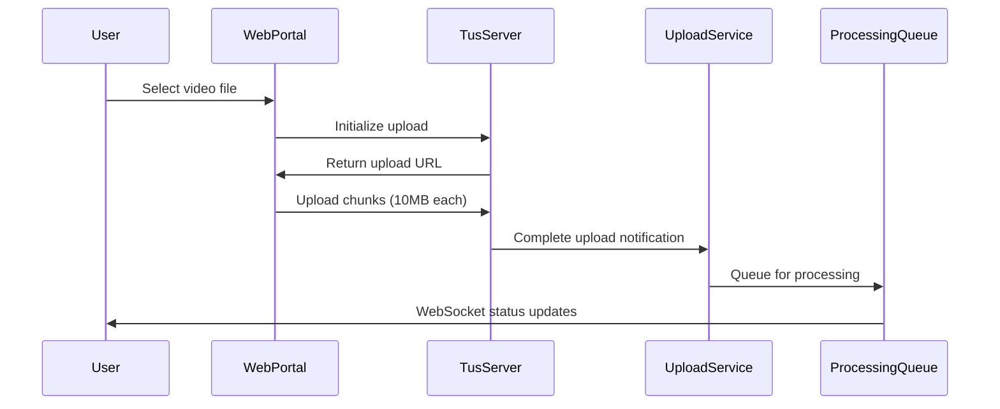

# DeepAV - Low-Level Design (LLD)
## Crowdsourced Autonomous Vehicle Training Data Platform

### Version: 1.0
### Date: 2024-12-27
### Author: Deep Ubuntu Research Team

---

## Table of Contents

1. [System Architecture Overview](#1-system-architecture-overview)
2. [User-Facing Components](#2-user-facing-components)
3. [Backend Services](#3-backend-services)
4. [Data Processing Pipeline](#4-data-processing-pipeline)
5. [Storage Architecture](#5-storage-architecture)
6. [API Specifications](#6-api-specifications)
7. [Database Schema](#7-database-schema)
8. [Infrastructure Requirements](#8-infrastructure-requirements)
9. [Security & Privacy](#9-security--privacy)
10. [Monitoring & Analytics](#10-monitoring--analytics)
11. [Deployment Strategy](#11-deployment-strategy)
12. [Implementation Timeline](#12-implementation-timeline)

---

## 1. System Architecture Overview

### 1.1 High-Level Architecture

```
┌─────────────────┐    ┌─────────────────┐    ┌─────────────────┐
│   Web Portal    │    │   Dashcam API   │    │  Mobile App     │
│   (React/Next)  │    │   Integration   │    │   (Future)      │
└─────────┬───────┘    └─────────┬───────┘    └─────────┬───────┘
          │                      │                      │
          └──────────────────────┼──────────────────────┘
                                 │
                    ┌─────────────┴───────────────┐
                    │      API Gateway            │
                    │   (AWS API Gateway/Kong)    │
                    └─────────────┬───────────────┘
                                 │
        ┌────────────────────────┼────────────────────────┐
        │                       │                       │
┌───────▼───────┐    ┌──────────▼──────────┐    ┌───────▼───────┐
│ Upload Service │    │ User Mgmt Service   │    │Metadata Service│
│   (Node.js)    │    │    (Node.js)        │    │  (FastAPI)     │
└───────┬───────┘    └──────────┬──────────┘    └───────┬───────┘
        │                       │                       │
        └───────────────────────┼───────────────────────┘
                               │
                 ┌─────────────▼───────────────┐
                 │   Processing Orchestrator   │
                 │      (Temporal.io)          │
                 └─────────────┬───────────────┘
                               │
      ┌────────────────────────┼────────────────────────┐
      │                       │                       │
┌─────▼─────┐    ┌─────────────▼─────────────┐    ┌────▼────┐
│  Privacy  │    │    Edge Case Detection    │    │ Quality │
│Processing │    │      (PyTorch/GPU)        │    │Analysis │
└───────────┘    └───────────────────────────┘    └─────────┘
      │                       │                       │
      └───────────────────────┼───────────────────────┘
                              │
                   ┌──────────▼──────────┐
                   │    Storage Layer     │
                   │  (S3/GCS + MongoDB  │
                   │   + PostgreSQL)     │
                   └─────────────────────┘
```

### 1.2 Core Principles

- **Microservices Architecture**: Independent, scalable services
- **Event-Driven Processing**: Asynchronous processing with message queues
- **Privacy by Design**: Built-in anonymization and data protection
- **Horizontal Scalability**: Auto-scaling based on demand
- **Cost Optimization**: Intelligent data lifecycle management

---

## 2. User-Facing Components

### 2.1 Web Portal (React/Next.js/TypeScript)

#### 2.1.1 Project Structure
```
deepav-portal/
├── components/
│   ├── upload/
│   │   ├── FileUploader.tsx
│   │   ├── UploadProgress.tsx
│   │   └── ResumeUpload.tsx
│   ├── dashboard/
│   │   ├── ContributionStats.tsx
│   │   ├── CoverageMap.tsx
│   │   └── RewardTracker.tsx
│   └── common/
├── pages/
│   ├── api/
│   ├── upload.tsx
│   ├── dashboard.tsx
│   └── rewards.tsx
├── hooks/
│   ├── useUpload.ts
│   ├── useAuth.ts
│   └── useWebSocket.ts
├── services/
│   ├── uploadService.ts
│   ├── authService.ts
│   └── apiClient.ts
└── types/
    └── index.ts
```

#### 2.1.2 Key Components

**FileUploader Component**
```typescript
interface FileUploaderProps {
  maxFileSize: number; // 10GB
  acceptedFormats: string[];
  onUploadProgress: (progress: number) => void;
  onUploadComplete: (uploadId: string) => void;
}

// Features:
// - Drag & drop interface
// - Tus resumable upload protocol
// - Chunk size optimization (10MB chunks)
// - Real-time progress tracking
```

**Dashboard Component**
```typescript
interface DashboardStats {
  totalUploads: number;
  totalDuration: number; // in minutes
  edgeCasesContributed: number;
  rewardsEarned: number;
  coverageAreas: GeoLocation[];
}

// Features:
// - Real-time statistics
// - Interactive coverage map
// - Processing status tracking
// - Reward history
```

#### 2.1.3 Upload Flow


### 2.2 Dashcam Integration

#### 2.2.1 Supported Devices
- **Blackvue**: DR900X, DR750X, DR590X series
- **Thinkware**: X1000, F800, Q800PRO
- **Garmin**: Dash Cam 67W, 57, 47
- **Generic**: WiFi-enabled cameras with HTTP API

#### 2.2.2 Integration Methods

**WiFi Direct Upload**
```javascript
// Dashcam API Integration
const uploadFromDashcam = async (deviceIP) => {
  const files = await fetchFileList(deviceIP);
  const selectedFiles = filterByDateRange(files, lastUploadDate);
  
  for (const file of selectedFiles) {
    await uploadFileStream(deviceIP, file.path);
  }
};
```

**Companion App Integration**
```typescript
interface DashcamAPI {
  authenticate(credentials: DeviceCredentials): Promise<AuthToken>;
  listFiles(dateRange: DateRange): Promise<FileMetadata[]>;
  downloadFile(fileId: string): Promise<ReadableStream>;
  deleteFile(fileId: string): Promise<boolean>;
}
```

---

## 3. Backend Services

### 3.1 Upload Service (Node.js/Express)

#### 3.1.1 Service Architecture
```typescript
// Core Upload Service Structure
class UploadService {
  private tusServer: TusServer;
  private storageManager: StorageManager;
  private queueManager: QueueManager;

  async initializeUpload(metadata: UploadMetadata): Promise<UploadSession>;
  async handleUploadComplete(uploadId: string): Promise<void>;
  async validateFile(filePath: string): Promise<ValidationResult>;
  async extractInitialMetadata(filePath: string): Promise<BasicMetadata>;
}
```

#### 3.1.2 File Validation Pipeline
```typescript
interface ValidationRules {
  maxFileSize: 10 * 1024 * 1024 * 1024; // 10GB
  allowedFormats: ['mp4', 'avi', 'mov', 'mkv'];
  minDuration: 60; // seconds
  maxDuration: 8 * 3600; // 8 hours
  requiredMetadata: ['timestamp', 'gps_optional'];
}

class FileValidator {
  async validateTechnical(file: File): Promise<TechnicalValidation>;
  async validateContent(file: File): Promise<ContentValidation>;
  async validateMetadata(metadata: FileMetadata): Promise<MetadataValidation>;
}
```

#### 3.1.3 Storage Management
```typescript
class StorageManager {
  // Raw storage: immediate after upload
  async moveToRawStorage(tempPath: string, metadata: UploadMetadata): Promise<string>;
  
  // Processing storage: during pipeline
  async moveToProcessing(rawPath: string): Promise<string>;
  
  // Archive storage: after processing
  async archiveProcessedFile(processedPath: string, retentionDays: number): Promise<void>;
}
```

### 3.2 User Management Service

#### 3.2.1 User Schema
```typescript
interface User {
  id: string;
  email: string;
  profile: {
    name: string;
    location?: GeoLocation;
    contributorLevel: 'bronze' | 'silver' | 'gold' | 'platinum';
    joinDate: Date;
  };
  statistics: {
    totalUploads: number;
    totalDurationMinutes: number;
    edgeCasesContributed: number;
    qualityScore: number; // 0-100
  };
  rewards: {
    pointsEarned: number;
    pointsRedeemed: number;
    achievements: Achievement[];
  };
  preferences: {
    autoUpload: boolean;
    privacyLevel: 'standard' | 'strict';
    notifications: NotificationSettings;
  };
}
```

#### 3.2.2 Authentication & Authorization
```typescript
class AuthService {
  async register(userData: UserRegistration): Promise<User>;
  async login(credentials: LoginCredentials): Promise<AuthToken>;
  async refreshToken(refreshToken: string): Promise<AuthToken>;
  async validateToken(token: string): Promise<TokenPayload>;
  
  // OAuth integration
  async googleAuth(googleToken: string): Promise<AuthToken>;
  async githubAuth(githubCode: string): Promise<AuthToken>;
}

interface AuthToken {
  accessToken: string;
  refreshToken: string;
  expiresIn: number;
  tokenType: 'Bearer';
  scope: string[];
}
```

### 3.3 Metadata Service (FastAPI/Python)

#### 3.3.1 Metadata Extraction Pipeline
```python
from fastapi import FastAPI, UploadFile
from typing import Dict, Any, Optional
import asyncio

class MetadataExtractor:
    def __init__(self):
        self.ffmpeg_client = FFmpegClient()
        self.exif_parser = ExifParser()
        self.gps_parser = GPSParser()
    
    async def extract_comprehensive_metadata(
        self, 
        file_path: str
    ) -> Dict[str, Any]:
        # Parallel extraction
        technical_task = self.extract_technical_metadata(file_path)
        spatial_task = self.extract_spatial_metadata(file_path)
        temporal_task = self.extract_temporal_metadata(file_path)
        
        technical, spatial, temporal = await asyncio.gather(
            technical_task, spatial_task, temporal_task
        )
        
        return {
            "technical": technical,
            "spatial": spatial,
            "temporal": temporal,
            "environmental": await self.detect_environmental_conditions(file_path)
        }
```

#### 3.3.2 Metadata Schema
```python
from pydantic import BaseModel
from typing import Optional, List
from datetime import datetime

class TechnicalMetadata(BaseModel):
    duration: float  # seconds
    fps: float
    resolution: tuple[int, int]  # (width, height)
    codec: str
    bitrate: int  # kbps
    file_size: int  # bytes
    audio_present: bool

class SpatialMetadata(BaseModel):
    gps_coordinates: Optional[List[tuple[float, float, datetime]]]  # lat, lon, timestamp
    country: Optional[str]
    region: Optional[str]
    road_type: Optional[str]  # highway, urban, rural
    elevation_data: Optional[List[float]]

class EnvironmentalMetadata(BaseModel):
    lighting_conditions: str  # day, night, dawn, dusk
    weather_detected: Optional[str]  # clear, rain, snow, fog
    season_detected: Optional[str]
    traffic_density: Optional[str]  # light, moderate, heavy
```

### 3.4 Processing Orchestration (Temporal.io)

#### 3.4.1 Workflow Definition
```python
from temporalio import workflow, activity
from datetime import timedelta

@workflow.defn
class VideoProcessingWorkflow:
    @workflow.run
    async def run(self, video_id: str) -> ProcessingResult:
        # Step 1: Privacy Processing (blocking)
        privacy_result = await workflow.execute_activity(
            privacy_processing,
            video_id,
            start_to_close_timeout=timedelta(hours=2)
        )
        
        # Step 2: Parallel processing
        edge_detection_task = workflow.execute_activity(
            edge_case_detection, privacy_result.anonymized_path
        )
        quality_analysis_task = workflow.execute_activity(
            quality_analysis, privacy_result.anonymized_path
        )
        segmentation_task = workflow.execute_activity(
            video_segmentation, privacy_result.anonymized_path
        )
        
        # Wait for all parallel tasks
        edge_result, quality_result, segmentation_result = await asyncio.gather(
            edge_detection_task, quality_analysis_task, segmentation_task
        )
        
        # Step 3: Final processing
        dataset_integration = await workflow.execute_activity(
            integrate_to_dataset,
            {
                "video_id": video_id,
                "privacy_result": privacy_result,
                "edge_cases": edge_result,
                "quality_metrics": quality_result,
                "segments": segmentation_result
            }
        )
        
        return ProcessingResult(
            video_id=video_id,
            status="completed",
            processing_time=workflow.now() - workflow.start_time,
            results=dataset_integration
        )
```

---

## 4. Data Processing Pipeline

### 4.1 Privacy Compliance Processing

#### 4.1.1 Face Anonymization
```python
import torch
import cv2
from mtcnn import MTCNN

class FaceAnonymizer:
    def __init__(self):
        self.detector = MTCNN(device='cuda' if torch.cuda.is_available() else 'cpu')
        self.blur_strength = 15
    
    def process_frame(self, frame: np.ndarray) -> np.ndarray:
        faces = self.detector.detect_faces(frame)
        
        for face in faces:
            x, y, w, h = face['box']
            confidence = face['confidence']
            
            if confidence > 0.95:  # High confidence detection
                # Apply Gaussian blur to face region
                face_region = frame[y:y+h, x:x+w]
                blurred_face = cv2.GaussianBlur(face_region, (self.blur_strength, self.blur_strength), 0)
                frame[y:y+h, x:x+w] = blurred_face
        
        return frame
    
    async def process_video(self, input_path: str, output_path: str) -> ProcessingStats:
        cap = cv2.VideoCapture(input_path)
        fps = cap.get(cv2.CAP_PROP_FPS)
        frame_count = int(cap.get(cv2.CAP_PROP_FRAME_COUNT))
        
        # Video writer setup
        fourcc = cv2.VideoWriter_fourcc(*'mp4v')
        out = cv2.VideoWriter(output_path, fourcc, fps, (width, height))
        
        faces_detected = 0
        frames_processed = 0
        
        while True:
            ret, frame = cap.read()
            if not ret:
                break
                
            processed_frame = self.process_frame(frame)
            out.write(processed_frame)
            frames_processed += 1
            
            # Progress reporting
            if frames_processed % 30 == 0:  # Every second at 30fps
                await self.report_progress(frames_processed / frame_count)
        
        cap.release()
        out.release()
        
        return ProcessingStats(
            frames_processed=frames_processed,
            faces_detected=faces_detected,
            processing_duration=time.time() - start_time
        )
```

#### 4.1.2 License Plate Anonymization
```python
import torch
from ultralytics import YOLO

class LicensePlateAnonymizer:
    def __init__(self):
        self.model = YOLO('license_plate_model.pt')  # Custom trained model
        self.confidence_threshold = 0.7
    
    def detect_license_plates(self, frame: np.ndarray) -> List[BoundingBox]:
        results = self.model(frame, conf=self.confidence_threshold)
        plates = []
        
        for result in results:
            boxes = result.boxes
            if boxes is not None:
                for box in boxes:
                    x1, y1, x2, y2 = box.xyxy[0].tolist()
                    confidence = box.conf[0].item()
                    plates.append({
                        'bbox': (int(x1), int(y1), int(x2), int(y2)),
                        'confidence': confidence
                    })
        
        return plates
    
    def anonymize_plates(self, frame: np.ndarray, plates: List[BoundingBox]) -> np.ndarray:
        for plate in plates:
            x1, y1, x2, y2 = plate['bbox']
            # Replace with solid color block
            cv2.rectangle(frame, (x1, y1), (x2, y2), (128, 128, 128), -1)
            
        return frame
```

### 4.2 Edge Case Detection

#### 4.2.1 Road Anomaly Detection
```python
import torch.nn as nn
from torchvision import transforms

class RoadAnomalyDetector:
    def __init__(self):
        self.model = self.load_pretrained_model()
        self.transform = transforms.Compose([
            transforms.Resize((224, 224)),
            transforms.ToTensor(),
            transforms.Normalize(mean=[0.485, 0.456, 0.406], 
                               std=[0.229, 0.224, 0.225])
        ])
        
        self.anomaly_classes = {
            0: 'pothole',
            1: 'construction_zone', 
            2: 'debris',
            3: 'flood_water',
            4: 'ice_patch',
            5: 'road_damage',
            6: 'unmarked_obstacle'
        }
    
    def detect_anomalies(self, frame: np.ndarray) -> List[AnomalyDetection]:
        # Sliding window approach for anomaly detection
        anomalies = []
        window_size = 416
        stride = 208  # 50% overlap
        
        h, w = frame.shape[:2]
        for y in range(0, h - window_size, stride):
            for x in range(0, w - window_size, stride):
                window = frame[y:y+window_size, x:x+window_size]
                
                # Preprocess and predict
                tensor = self.transform(window).unsqueeze(0)
                with torch.no_grad():
                    prediction = self.model(tensor)
                    probabilities = torch.softmax(prediction, dim=1)
                    
                    max_prob, predicted_class = torch.max(probabilities, 1)
                    
                    if max_prob > 0.8:  # High confidence threshold
                        anomalies.append({
                            'class': self.anomaly_classes[predicted_class.item()],
                            'confidence': max_prob.item(),
                            'bbox': (x, y, x + window_size, y + window_size),
                            'timestamp': self.get_frame_timestamp()
                        })
        
        return anomalies
```

#### 4.2.2 Traffic Pattern Analysis
```python
from typing import Dict, List, Tuple
import numpy as np

class TrafficPatternAnalyzer:
    def __init__(self):
        self.vehicle_tracker = VehicleTracker()
        self.behavior_classifier = BehaviorClassifier()
        
    def analyze_traffic_patterns(self, video_path: str) -> TrafficAnalysis:
        cap = cv2.VideoCapture(video_path)
        
        traffic_events = []
        vehicle_trajectories = {}
        unusual_behaviors = []
        
        frame_count = 0
        while True:
            ret, frame = cap.read()
            if not ret:
                break
                
            # Detect and track vehicles
            vehicles = self.vehicle_tracker.update(frame)
            
            # Analyze behaviors
            for vehicle_id, trajectory in vehicles.items():
                if len(trajectory) >= 10:  # Minimum frames for analysis
                    behavior = self.behavior_classifier.classify(trajectory)
                    
                    if behavior in ['sudden_lane_change', 'hard_braking', 'aggressive_acceleration']:
                        unusual_behaviors.append({
                            'vehicle_id': vehicle_id,
                            'behavior': behavior,
                            'frame_start': frame_count - len(trajectory),
                            'frame_end': frame_count,
                            'confidence': behavior.confidence
                        })
            
            # Detect traffic events
            events = self.detect_traffic_events(frame, vehicles)
            traffic_events.extend(events)
            
            frame_count += 1
        
        return TrafficAnalysis(
            total_vehicles=len(vehicle_trajectories),
            unusual_behaviors=unusual_behaviors,
            traffic_events=traffic_events,
            density_analysis=self.calculate_density_metrics(vehicle_trajectories)
        )
```

### 4.3 Quality Analysis

#### 4.3.1 Visual Quality Assessment
```python
import cv2
import numpy as np
from skimage.metrics import structural_similarity as ssim

class VideoQualityAnalyzer:
    def __init__(self):
        self.blur_threshold = 100
        self.exposure_range = (50, 200)  # Acceptable brightness range
        
    def assess_frame_quality(self, frame: np.ndarray) -> Dict[str, float]:
        gray = cv2.cvtColor(frame, cv2.COLOR_BGR2GRAY)
        
        # Blur detection using Laplacian variance
        blur_score = cv2.Laplacian(gray, cv2.CV_64F).var()
        
        # Exposure analysis
        mean_brightness = np.mean(gray)
        exposure_score = self.calculate_exposure_score(mean_brightness)
        
        # Contrast analysis
        contrast_score = np.std(gray)
        
        # Motion blur detection
        motion_blur_score = self.detect_motion_blur(gray)
        
        return {
            'blur_score': blur_score,
            'exposure_score': exposure_score,
            'contrast_score': contrast_score,
            'motion_blur_score': motion_blur_score,
            'overall_quality': self.calculate_overall_quality(
                blur_score, exposure_score, contrast_score, motion_blur_score
            )
        }
    
    def analyze_video_quality(self, video_path: str) -> VideoQualityReport:
        cap = cv2.VideoCapture(video_path)
        
        frame_qualities = []
        total_frames = int(cap.get(cv2.CAP_PROP_FRAME_COUNT))
        
        # Sample every 30th frame for quality analysis
        sample_interval = 30
        
        for frame_idx in range(0, total_frames, sample_interval):
            cap.set(cv2.CAP_PROP_POS_FRAMES, frame_idx)
            ret, frame = cap.read()
            
            if ret:
                quality_metrics = self.assess_frame_quality(frame)
                quality_metrics['frame_index'] = frame_idx
                frame_qualities.append(quality_metrics)
        
        cap.release()
        
        return VideoQualityReport(
            average_quality=np.mean([f['overall_quality'] for f in frame_qualities]),
            quality_distribution=self.calculate_quality_distribution(frame_qualities),
            problematic_segments=self.identify_problematic_segments(frame_qualities),
            recommendation=self.generate_quality_recommendation(frame_qualities)
        )
```

---

## 5. Storage Architecture

### 5.1 Data Storage Strategy

#### 5.1.1 Storage Tiers
```yaml
# Storage Architecture Configuration
storage_tiers:
  raw_uploads:
    provider: "aws_s3"
    storage_class: "standard"
    lifecycle_rules:
      - transition_to_ia: 30_days
      - transition_to_glacier: 90_days
      - expire_after: 365_days
    encryption: "server_side_aes256"
    
  processed_data:
    provider: "aws_s3"  
    storage_class: "standard_ia"
    lifecycle_rules:
      - transition_to_glacier: 180_days
      - expire_after: 1095_days  # 3 years
    
  valuable_datasets:
    provider: "aws_s3"
    storage_class: "standard"
    versioning: true
    cross_region_replication: true
    backup_strategy: "point_in_time"
```

#### 5.1.2 Directory Structure
```
deepav-storage/
├── raw/
│   ├── {user_id}/
│   │   ├── {upload_date}/
│   │   │   ├── {video_id}/
│   │   │   │   ├── original.mp4
│   │   │   │   ├── metadata.json
│   │   │   │   └── upload_info.json
├── processing/
│   ├── {video_id}/
│   │   ├── anonymized.mp4
│   │   ├── segments/
│   │   │   ├── segment_001.mp4
│   │   │   ├── segment_002.mp4
│   │   └── analysis/
│   │       ├── quality_report.json
│   │       ├── edge_cases.json
│   │       └── metadata_extracted.json
├── datasets/
│   ├── edge_cases/
│   │   ├── potholes/
│   │   ├── construction_zones/
│   │   └── weather_anomalies/
│   ├── geographic/
│   │   ├── urban/
│   │   ├── highway/
│   │   └── rural/
│   └── temporal/
│       ├── day/
│       ├── night/
│       └── weather_conditions/
└── exports/
    ├── customer_datasets/
    │   ├── {customer_id}/
    │   │   ├── {dataset_id}/
    └── public_datasets/
        ├── research/
        └── academic/
```

#### 5.1.3 Storage Management Service
```typescript
class StorageManager {
  private s3Client: S3Client;
  private lifecycleManager: LifecycleManager;
  
  async uploadToRawStorage(
    file: Buffer,
    metadata: UploadMetadata
  ): Promise<StorageLocation> {
    const key = this.generateStorageKey('raw', metadata);
    
    const uploadParams = {
      Bucket: process.env.RAW_STORAGE_BUCKET,
      Key: key,
      Body: file,
      Metadata: {
        userId: metadata.userId,
        uploadTimestamp: metadata.timestamp.toISOString(),
        originalFilename: metadata.originalFilename,
        contentType: metadata.contentType
      },
      ServerSideEncryption: 'AES256',
      StorageClass: 'STANDARD'
    };
    
    const result = await this.s3Client.send(new PutObjectCommand(uploadParams));
    
    // Create lifecycle rule for this object
    await this.lifecycleManager.createRule(key, metadata.retentionPolicy);
    
    return {
      bucket: uploadParams.Bucket,
      key: key,
      version: result.VersionId,
      etag: result.ETag
    };
  }
  
  async moveToProcessing(rawLocation: StorageLocation): Promise<StorageLocation> {
    const newKey = this.generateStorageKey('processing', rawLocation);
    
    await this.s3Client.send(new CopyObjectCommand({
      CopySource: `${rawLocation.bucket}/${rawLocation.key}`,
      Bucket: process.env.PROCESSING_STORAGE_BUCKET,
      Key: newKey
    }));
    
    return { bucket: process.env.PROCESSING_STORAGE_BUCKET, key: newKey };
  }
  
  private generateStorageKey(tier: string, metadata: any): string {
    const datePath = new Date().toISOString().slice(0, 10); // YYYY-MM-DD
    return `${tier}/${metadata.userId}/${datePath}/${metadata.videoId}/${metadata.filename}`;
  }
}
```

### 5.2 Database Architecture

#### 5.2.1 PostgreSQL Schema (User Data)
```sql
-- Users table
CREATE TABLE users (
    id UUID PRIMARY KEY DEFAULT gen_random_uuid(),
    email VARCHAR(255) UNIQUE NOT NULL,
    password_hash VARCHAR(255) NOT NULL,
    name VARCHAR(255) NOT NULL,
    created_at TIMESTAMP WITH TIME ZONE DEFAULT NOW(),
    updated_at TIMESTAMP WITH TIME ZONE DEFAULT NOW(),
    is_active BOOLEAN DEFAULT true,
    contributor_level VARCHAR(20) DEFAULT 'bronze'
);

-- Upload sessions table
CREATE TABLE upload_sessions (
    id UUID PRIMARY KEY DEFAULT gen_random_uuid(),
    user_id UUID NOT NULL REFERENCES users(id),
    filename VARCHAR(500) NOT NULL,
    file_size BIGINT NOT NULL,
    content_type VARCHAR(100),
    upload_status VARCHAR(20) DEFAULT 'pending',
    created_at TIMESTAMP WITH TIME ZONE DEFAULT NOW(),
    completed_at TIMESTAMP WITH TIME ZONE,
    storage_location JSONB,
    metadata JSONB
);

-- Processing jobs table  
CREATE TABLE processing_jobs (
    id UUID PRIMARY KEY DEFAULT gen_random_uuid(),
    upload_session_id UUID NOT NULL REFERENCES upload_sessions(id),
    job_type VARCHAR(50) NOT NULL,
    status VARCHAR(20) DEFAULT 'queued',
    started_at TIMESTAMP WITH TIME ZONE,
    completed_at TIMESTAMP WITH TIME ZONE,
    result JSONB,
    error_message TEXT,
    processing_duration_seconds INTEGER
);

-- User statistics table
CREATE TABLE user_statistics (
    user_id UUID PRIMARY KEY REFERENCES users(id),
    total_uploads INTEGER DEFAULT 0,
    total_duration_minutes INTEGER DEFAULT 0,
    edge_cases_contributed INTEGER DEFAULT 0,
    quality_score DECIMAL(3,2) DEFAULT 0.0,
    points_earned INTEGER DEFAULT 0,
    points_redeemed INTEGER DEFAULT 0,
    last_updated TIMESTAMP WITH TIME ZONE DEFAULT NOW()
);

-- Indexes for performance
CREATE INDEX idx_upload_sessions_user_id ON upload_sessions(user_id);
CREATE INDEX idx_upload_sessions_status ON upload_sessions(upload_status);
CREATE INDEX idx_processing_jobs_status ON processing_jobs(status);
CREATE INDEX idx_processing_jobs_upload_id ON processing_jobs(upload_session_id);
```

#### 5.2.2 MongoDB Schema (Metadata & Analytics)
```javascript
// Video metadata collection
db.video_metadata.createIndex({ "video_id": 1 }, { unique: true });
db.video_metadata.createIndex({ "spatial.country": 1, "spatial.region": 1 });
db.video_metadata.createIndex({ "temporal.recording_date": 1 });
db.video_metadata.createIndex({ "technical.duration": 1 });

// Sample document structure
{
  "_id": ObjectId("..."),
  "video_id": "uuid-string",
  "upload_session_id": "uuid-string", 
  "user_id": "uuid-string",
  "technical": {
    "duration": 3600.5,
    "fps": 30.0,
    "resolution": [1920, 1080],
    "codec": "h264",
    "bitrate": 5000,
    "file_size": 2147483648,
    "audio_present": true
  },
  "spatial": {
    "gps_track": [
      {
        "lat": 40.7128,
        "lon": -74.0060, 
        "timestamp": ISODate("2024-01-01T12:00:00Z"),
        "accuracy": 5.0
      }
    ],
    "country": "US",
    "region": "NY",
    "road_types": ["urban", "highway"],
    "elevation_range": [10.5, 125.7]
  },
  "environmental": {
    "lighting_conditions": ["day", "dusk"],
    "weather_detected": "clear",
    "season": "winter",
    "traffic_density": "moderate"
  },
  "quality_metrics": {
    "overall_score": 8.7,
    "blur_score": 95.2,
    "exposure_score": 8.1,
    "stability_score": 9.2
  },
  "edge_cases": [
    {
      "type": "pothole",
      "confidence": 0.92,
      "timestamp": 125.3,
      "bbox": [100, 200, 300, 400],
      "severity": "moderate"
    }
  ],
  "processing_status": {
    "privacy_processed": true,
    "edge_detection_complete": true,
    "quality_analysis_complete": true,
    "dataset_integration_complete": true
  },
  "created_at": ISODate("2024-01-01T12:00:00Z"),
  "updated_at": ISODate("2024-01-01T15:30:00Z")
}
```

---

## 6. API Specifications

### 6.1 RESTful API Endpoints

#### 6.1.1 Authentication Endpoints
```typescript
// POST /api/v1/auth/register
interface RegisterRequest {
  email: string;
  password: string;
  name: string;
  location?: {
    country: string;
    region: string;
  };
}

interface RegisterResponse {
  user: User;
  tokens: AuthTokens;
}

// POST /api/v1/auth/login
interface LoginRequest {
  email: string;
  password: string;
}

interface LoginResponse {
  user: User;
  tokens: AuthTokens;
}

// POST /api/v1/auth/refresh
interface RefreshRequest {
  refresh_token: string;
}

interface RefreshResponse {
  tokens: AuthTokens;
}
```

#### 6.1.2 Upload Endpoints
```typescript
// POST /api/v1/uploads/initialize
interface InitializeUploadRequest {
  filename: string;
  file_size: number;
  content_type: string;
  metadata?: {
    recording_date?: string;
    device_info?: string;
    location_hint?: GeoLocation;
  };
}

interface InitializeUploadResponse {
  upload_id: string;
  upload_url: string;  // Tus server URL
  chunk_size: number;
  max_chunks: number;
}

// GET /api/v1/uploads/{upload_id}/status
interface UploadStatusResponse {
  upload_id: string;
  status: 'pending' | 'uploading' | 'processing' | 'completed' | 'failed';
  progress: number;  // 0-100
  processing_stage?: string;
  estimated_completion?: string;
  error_message?: string;
}

// GET /api/v1/uploads/history
interface UploadHistoryQuery {
  page?: number;
  limit?: number;
  status?: string;
  date_from?: string;
  date_to?: string;
}

interface UploadHistoryResponse {
  uploads: UploadSummary[];
  pagination: {
    page: number;
    limit: number;
    total: number;
    total_pages: number;
  };
}
```

#### 6.1.3 Dashboard & Analytics Endpoints
```typescript
// GET /api/v1/dashboard/stats
interface DashboardStatsResponse {
  user_stats: {
    total_uploads: number;
    total_duration_hours: number;
    edge_cases_contributed: number;
    quality_average: number;
    contributor_level: string;
    points_earned: number;
  };
  recent_uploads: UploadSummary[];
  processing_queue: {
    pending: number;
    processing: number;
    estimated_wait_time: number;
  };
  achievements: Achievement[];
}

// GET /api/v1/dashboard/coverage-map
interface CoverageMapQuery {
  zoom_level: number;
  bounds: {
    north: number;
    south: number;
    east: number; 
    west: number;
  };
}

interface CoverageMapResponse {
  coverage_areas: {
    lat: number;
    lon: number;
    coverage_level: 'low' | 'medium' | 'high';
    upload_count: number;
  }[];
  total_coverage_km2: number;
}
```

### 6.2 GraphQL Schema
```graphql
type User {
  id: ID!
  email: String!
  name: String!
  contributorLevel: ContributorLevel!
  statistics: UserStatistics!
  uploads(first: Int, after: String): UploadConnection!
  achievements: [Achievement!]!
  createdAt: DateTime!
}

type Upload {
  id: ID!
  filename: String!
  fileSize: Int!
  status: UploadStatus!
  progress: Float!
  metadata: VideoMetadata
  processingJobs: [ProcessingJob!]!
  createdAt: DateTime!
  completedAt: DateTime
}

type VideoMetadata {
  duration: Float!
  resolution: Resolution!
  fps: Float!
  gpsTrack: [GPSPoint!]!
  environmentalConditions: EnvironmentalConditions!
  qualityMetrics: QualityMetrics!
  edgeCases: [EdgeCase!]!
}

type Query {
  me: User
  upload(id: ID!): Upload
  uploads(filter: UploadFilter, sort: UploadSort): UploadConnection!
  dashboardStats: DashboardStats!
  coverageMap(bounds: GeoBounds!, zoom: Int!): CoverageMap!
}

type Mutation {
  initializeUpload(input: InitializeUploadInput!): InitializeUploadPayload!
  updateUserProfile(input: UpdateProfileInput!): User!
  redeemPoints(achievementId: ID!): PointRedemption!
}

type Subscription {
  uploadProgress(uploadId: ID!): UploadProgress!
  processingUpdates(userId: ID!): ProcessingUpdate!
}
```

### 6.3 WebSocket Events
```typescript
// Upload progress events
interface UploadProgressEvent {
  type: 'upload_progress';
  upload_id: string;
  bytes_uploaded: number;
  total_bytes: number;
  progress_percentage: number;
  estimated_completion: string;
}

// Processing status events
interface ProcessingStatusEvent {
  type: 'processing_status';
  upload_id: string;
  stage: 'privacy' | 'edge_detection' | 'quality_analysis' | 'segmentation';
  status: 'started' | 'completed' | 'failed';
  progress_percentage: number;
  message?: string;
}

// Achievement unlocked events
interface AchievementEvent {
  type: 'achievement_unlocked';
  user_id: string;
  achievement: Achievement;
  points_earned: number;
}

// WebSocket client implementation
class DeepAVWebSocket {
  private ws: WebSocket;
  private reconnectAttempts = 0;
  private maxReconnectAttempts = 5;
  
  constructor(private authToken: string) {
    this.connect();
  }
  
  private connect() {
    const wsUrl = `${process.env.WS_URL}?token=${this.authToken}`;
    this.ws = new WebSocket(wsUrl);
    
    this.ws.onopen = () => {
      console.log('WebSocket connected');
      this.reconnectAttempts = 0;
    };
    
    this.ws.onmessage = (event) => {
      const data = JSON.parse(event.data);
      this.handleEvent(data);
    };
    
    this.ws.onclose = () => {
      if (this.reconnectAttempts < this.maxReconnectAttempts) {
        setTimeout(() => {
          this.reconnectAttempts++;
          this.connect();
        }, Math.pow(2, this.reconnectAttempts) * 1000); // Exponential backoff
      }
    };
  }
  
  subscribeToUpload(uploadId: string) {
    this.ws.send(JSON.stringify({
      action: 'subscribe',
      channel: `upload:${uploadId}`
    }));
  }
}
```

---

## 7. Infrastructure Requirements

### 7.1 Kubernetes Deployment Architecture

#### 7.1.1 Cluster Configuration
```yaml
# cluster-config.yaml
apiVersion: v1
kind: Namespace
metadata:
  name: deepav-production

---
# Resource quotas
apiVersion: v1
kind: ResourceQuota
metadata:
  name: deepav-quota
  namespace: deepav-production
spec:
  hard:
    requests.cpu: "50"
    requests.memory: "200Gi"
    requests.nvidia.com/gpu: "10"
    persistentvolumeclaims: "20"
    services.loadbalancers: "5"
```

#### 7.1.2 Node Pools
```yaml
# Node pool configuration for different workloads

# General purpose nodes (API services, databases)
general_purpose_pool:
  machine_type: "e2-standard-8"  # 8 vCPUs, 32GB RAM
  min_nodes: 3
  max_nodes: 20
  disk_type: "pd-ssd"
  disk_size: "100GB"
  
# Memory optimized nodes (metadata processing, caching)  
memory_optimized_pool:
  machine_type: "e2-highmem-16"  # 16 vCPUs, 128GB RAM
  min_nodes: 2
  max_nodes: 10
  disk_type: "pd-ssd"
  disk_size: "200GB"
  
# GPU nodes (computer vision processing)
gpu_pool:
  machine_type: "n1-standard-16"  # 16 vCPUs, 60GB RAM
  accelerator_type: "nvidia-tesla-t4"
  accelerator_count: 2
  min_nodes: 2
  max_nodes: 8
  disk_type: "pd-ssd"
  disk_size: "500GB"
```

#### 7.1.3 Service Deployments
```yaml
# Web Portal Deployment
apiVersion: apps/v1
kind: Deployment
metadata:
  name: web-portal
  namespace: deepav-production
spec:
  replicas: 3
  selector:
    matchLabels:
      app: web-portal
  template:
    metadata:
      labels:
        app: web-portal
    spec:
      containers:
      - name: web-portal
        image: deepav/web-portal:v1.0.0
        ports:
        - containerPort: 3000
        env:
        - name: NODE_ENV
          value: "production"
        - name: API_BASE_URL
          value: "https://api.deepav.com"
        resources:
          requests:
            memory: "512Mi"
            cpu: "250m"
          limits:
            memory: "1Gi"
            cpu: "500m"
        livenessProbe:
          httpGet:
            path: /health
            port: 3000
          initialDelaySeconds: 30
          periodSeconds: 10
        readinessProbe:
          httpGet:
            path: /ready
            port: 3000
          initialDelaySeconds: 5
          periodSeconds: 5

---
# Upload Service Deployment
apiVersion: apps/v1
kind: Deployment
metadata:
  name: upload-service
  namespace: deepav-production
spec:
  replicas: 5
  selector:
    matchLabels:
      app: upload-service
  template:
    metadata:
      labels:
        app: upload-service
    spec:
      containers:
      - name: upload-service
        image: deepav/upload-service:v1.0.0
        ports:
        - containerPort: 8080
        env:
        - name: NODE_ENV
          value: "production"
        - name: MAX_FILE_SIZE
          value: "10737418240"  # 10GB
        - name: REDIS_URL
          valueFrom:
            secretKeyRef:
              name: deepav-secrets
              key: redis-url
        resources:
          requests:
            memory: "1Gi"
            cpu: "500m"
          limits:
            memory: "2Gi"
            cpu: "1000m"
```

### 7.2 Monitoring & Observability

#### 7.2.1 Prometheus Configuration
```yaml
# prometheus-config.yaml
apiVersion: v1
kind: ConfigMap
metadata:
  name: prometheus-config
  namespace: deepav-production
data:
  prometheus.yml: |
    global:
      scrape_interval: 15s
      evaluation_interval: 15s
    
    rule_files:
      - "/etc/prometheus/rules/*.yml"
    
    scrape_configs:
      - job_name: 'kubernetes-pods'
        kubernetes_sd_configs:
          - role: pod
        relabel_configs:
          - source_labels: [__meta_kubernetes_pod_annotation_prometheus_io_scrape]
            action: keep
            regex: true
          - source_labels: [__meta_kubernetes_pod_annotation_prometheus_io_path]
            action: replace
            target_label: __metrics_path__
            regex: (.+)
      
      - job_name: 'upload-service'
        static_configs:
          - targets: ['upload-service:8080']
        metrics_path: '/metrics'
        
      - job_name: 'processing-jobs'
        static_configs:
          - targets: ['processing-service:8081']
        metrics_path: '/metrics'
```

#### 7.2.2 Custom Metrics
```python
# Custom metrics for processing pipeline
from prometheus_client import Counter, Histogram, Gauge
import time

# Upload metrics
upload_total = Counter('deepav_uploads_total', 'Total number of uploads', ['status', 'user_type'])
upload_duration = Histogram('deepav_upload_duration_seconds', 'Upload processing time')
upload_file_size = Histogram('deepav_upload_file_size_bytes', 'Upload file sizes')

# Processing metrics  
processing_duration = Histogram(
    'deepav_processing_duration_seconds', 
    'Processing time by stage',
    ['stage', 'status']
)

edge_cases_detected = Counter(
    'deepav_edge_cases_total',
    'Edge cases detected',
    ['type', 'confidence_level']
)

quality_score_distribution = Histogram(
    'deepav_quality_scores',
    'Distribution of video quality scores',
    buckets=[0.1, 0.2, 0.3, 0.4, 0.5, 0.6, 0.7, 0.8, 0.9, 1.0]
)

# Storage metrics
storage_usage = Gauge('deepav_storage_usage_bytes', 'Storage usage by tier', ['tier'])
storage_costs = Gauge('deepav_storage_costs_usd', 'Monthly storage costs', ['tier'])

# Usage in code
class ProcessingService:
    def process_video(self, video_id: str):
        start_time = time.time()
        
        try:
            # Process video
            result = self.run_processing_pipeline(video_id)
            
            # Record metrics
            processing_duration.labels(
                stage='complete', 
                status='success'
            ).observe(time.time() - start_time)
            
            # Record edge cases found
            for edge_case in result.edge_cases:
                edge_cases_detected.labels(
                    type=edge_case.type,
                    confidence_level='high' if edge_case.confidence > 0.8 else 'medium'
                ).inc()
                
        except Exception as e:
            processing_duration.labels(
                stage='failed',
                status='error'
            ).observe(time.time() - start_time)
            raise
```

#### 7.2.3 Alerting Rules
```yaml
# alerting-rules.yaml
groups:
  - name: deepav.upload
    rules:
      - alert: HighUploadFailureRate
        expr: rate(deepav_uploads_total{status="failed"}[5m]) / rate(deepav_uploads_total[5m]) > 0.1
        for: 2m
        labels:
          severity: warning
        annotations:
          summary: "High upload failure rate detected"
          description: "Upload failure rate is {{ $value | humanizePercentage }} over the last 5 minutes"
          
      - alert: ProcessingBacklogHigh
        expr: deepav_processing_queue_size > 1000
        for: 5m
        labels:
          severity: warning
        annotations:
          summary: "Processing backlog is high"
          description: "Processing queue has {{ $value }} items pending"
          
      - alert: StorageCostSpike
        expr: increase(deepav_storage_costs_usd[1h]) > 100
        for: 0m
        labels:
          severity: critical
        annotations:
          summary: "Storage costs spiking"
          description: "Storage costs increased by ${{ $value }} in the last hour"
          
  - name: deepav.performance
    rules:
      - alert: SlowProcessing
        expr: histogram_quantile(0.95, deepav_processing_duration_seconds) > 3600
        for: 10m
        labels:
          severity: warning  
        annotations:
          summary: "Video processing is slow"
          description: "95th percentile processing time is {{ $value | humanizeDuration }}"
```

---

## 8. Security & Privacy

### 8.1 Privacy Protection Strategy

#### 8.1.1 Data Minimization
```typescript
// Privacy-first data collection
interface PrivacySettings {
  dataRetention: {
    rawData: number;      // Days to keep raw uploads
    processedData: number; // Days to keep processed data
    userData: number;     // Days to keep user metadata
  };
  anonymization: {
    faceBlurStrength: number;     // Gaussian blur kernel size
    licensePlateObfuscation: boolean;
    gpsAccuracy: number;          // Meters of GPS fuzzing
    timestampGranularity: number; // Minutes of timestamp rounding
  };
  userConsent: {
    dataSharing: boolean;
    commercialUse: boolean;
    researchUse: boolean;
    retentionPeriod: number;
  };
}

class PrivacyManager {
  async processForPrivacy(videoPath: string, settings: PrivacySettings): Promise<ProcessedVideo> {
    const processor = new VideoProcessor();
    
    // Apply face anonymization
    if (settings.anonymization.faceBlurStrength > 0) {
      await processor.blurFaces(videoPath, settings.anonymization.faceBlurStrength);
    }
    
    // Obfuscate license plates
    if (settings.anonymization.licensePlateObfuscation) {
      await processor.anonymizeLicensePlates(videoPath);
    }
    
    // Fuzz GPS data if present
    if (settings.anonymization.gpsAccuracy > 0) {
      await processor.fuzzGPSData(videoPath, settings.anonymization.gpsAccuracy);
    }
    
    // Round timestamps
    if (settings.anonymization.timestampGranularity > 0) {
      await processor.roundTimestamps(videoPath, settings.anonymization.timestampGranularity);
    }
    
    return processor.getResult();
  }
}
```

#### 8.1.2 GDPR Compliance
```typescript
interface GDPRComplianceService {
  // Right to access
  async exportUserData(userId: string): Promise<UserDataExport>;
  
  // Right to rectification
  async updateUserData(userId: string, updates: Partial<User>): Promise<User>;
  
  // Right to erasure (right to be forgotten)
  async deleteUserData(userId: string, retainForLegal: boolean = false): Promise<DeletionReport>;
  
  // Right to restrict processing  
  async restrictProcessing(userId: string, restrictions: ProcessingRestrictions): Promise<void>;
  
  // Right to data portability
  async exportPortableData(userId: string, format: 'json' | 'csv' | 'xml'): Promise<Buffer>;
  
  // Right to object
  async processObjection(userId: string, objection: ProcessingObjection): Promise<void>;
}

class GDPRService implements GDPRComplianceService {
  async deleteUserData(userId: string, retainForLegal: boolean = false): Promise<DeletionReport> {
    const deletionTasks = [];
    
    // 1. Delete user uploads and processed data
    if (!retainForLegal) {
      deletionTasks.push(this.deleteUserUploads(userId));
      deletionTasks.push(this.deleteProcessedVideos(userId));
    } else {
      // Anonymize but retain for legal purposes
      deletionTasks.push(this.anonymizeUserData(userId));
    }
    
    // 2. Delete user account and profile
    deletionTasks.push(this.deleteUserAccount(userId));
    
    // 3. Remove from all caches and indexes
    deletionTasks.push(this.clearUserFromCaches(userId));
    
    // 4. Update data lineage tracking
    deletionTasks.push(this.updateDataLineage(userId, 'deleted'));
    
    const results = await Promise.allSettled(deletionTasks);
    
    return {
      userId: userId,
      deletionDate: new Date(),
      itemsDeleted: results.filter(r => r.status === 'fulfilled').length,
      errors: results.filter(r => r.status === 'rejected').map(r => r.reason),
      retainedForLegal: retainForLegal
    };
  }
}
```

### 8.2 Security Architecture

#### 8.2.1 Authentication & Authorization
```typescript
// JWT-based authentication with role-based access control
interface AuthToken {
  sub: string;  // User ID
  email: string;
  roles: Role[];
  permissions: Permission[];
  iat: number;
  exp: number;
  jti: string;  // Token ID for revocation
}

enum Role {
  USER = 'user',
  CONTRIBUTOR = 'contributor', 
  MODERATOR = 'moderator',
  ADMIN = 'admin',
  SYSTEM = 'system'
}

enum Permission {
  UPLOAD_VIDEO = 'upload:video',
  VIEW_OWN_UPLOADS = 'view:own_uploads',
  VIEW_ALL_UPLOADS = 'view:all_uploads',
  PROCESS_VIDEO = 'process:video',
  MANAGE_USERS = 'manage:users',
  EXPORT_DATA = 'export:data',
  DELETE_DATA = 'delete:data',
  VIEW_ANALYTICS = 'view:analytics'
}

class AuthService {
  private jwtSecret = process.env.JWT_SECRET!;
  private jwtRefreshSecret = process.env.JWT_REFRESH_SECRET!;
  
  async generateTokens(user: User): Promise<TokenPair> {
    const permissions = await this.getUserPermissions(user.id);
    
    const accessToken = jwt.sign({
      sub: user.id,
      email: user.email,
      roles: user.roles,
      permissions: permissions,
      type: 'access'
    }, this.jwtSecret, {
      expiresIn: '15m',
      issuer: 'deepav-api',
      audience: 'deepav-client'
    });
    
    const refreshToken = jwt.sign({
      sub: user.id,
      type: 'refresh',
      jti: uuidv4()
    }, this.jwtRefreshSecret, {
      expiresIn: '7d'
    });
    
    // Store refresh token for revocation capability
    await this.storeRefreshToken(user.id, refreshToken);
    
    return { accessToken, refreshToken };
  }
  
  async validateToken(token: string): Promise<AuthToken> {
    try {
      const decoded = jwt.verify(token, this.jwtSecret) as AuthToken;
      
      // Check if token is revoked
      const isRevoked = await this.isTokenRevoked(decoded.jti);
      if (isRevoked) {
        throw new Error('Token has been revoked');
      }
      
      return decoded;
    } catch (error) {
      throw new UnauthorizedError('Invalid or expired token');
    }
  }
}

// Authorization middleware
const authorize = (requiredPermissions: Permission[]) => {
  return (req: Request, res: Response, next: NextFunction) => {
    const token = req.headers.authorization?.replace('Bearer ', '');
    
    if (!token) {
      return res.status(401).json({ error: 'No token provided' });
    }
    
    try {
      const decoded = authService.validateToken(token);
      const userPermissions = decoded.permissions;
      
      const hasPermission = requiredPermissions.every(permission => 
        userPermissions.includes(permission)
      );
      
      if (!hasPermission) {
        return res.status(403).json({ error: 'Insufficient permissions' });
      }
      
      req.user = decoded;
      next();
    } catch (error) {
      return res.status(401).json({ error: 'Invalid token' });
    }
  };
};
```

#### 8.2.2 API Security
```typescript
// Rate limiting configuration
const rateLimitConfig = {
  upload: {
    windowMs: 15 * 60 * 1000, // 15 minutes
    maxRequests: 10,           // 10 uploads per window
    skipSuccessfulRequests: false,
    keyGenerator: (req) => req.user?.id || req.ip
  },
  
  api: {
    windowMs: 60 * 1000,       // 1 minute
    maxRequests: 100,          // 100 API calls per minute
    skipSuccessfulRequests: true
  },
  
  auth: {
    windowMs: 15 * 60 * 1000,  // 15 minutes  
    maxRequests: 5,            // 5 failed attempts
    skipSuccessfulRequests: true,
    keyGenerator: (req) => req.body.email || req.ip
  }
};

// Input validation and sanitization
import { body, param, validationResult } from 'express-validator';

const uploadValidation = [
  body('filename')
    .isLength({ min: 1, max: 255 })
    .matches(/^[a-zA-Z0-9._-]+\.(mp4|avi|mov|mkv)$/i)
    .withMessage('Invalid filename format'),
    
  body('file_size')
    .isInt({ min: 1, max: 10 * 1024 * 1024 * 1024 })
    .withMessage('File size must be between 1 byte and 10GB'),
    
  body('content_type')
    .isIn(['video/mp4', 'video/avi', 'video/quicktime', 'video/x-matroska'])
    .withMessage('Unsupported content type'),
    
  (req: Request, res: Response, next: NextFunction) => {
    const errors = validationResult(req);
    if (!errors.isEmpty()) {
      return res.status(400).json({
        error: 'Validation failed',
        details: errors.array()
      });
    }
    next();
  }
];

// Security headers
const securityMiddleware = [
  helmet({
    contentSecurityPolicy: {
      directives: {
        defaultSrc: ["'self'"],
        scriptSrc: ["'self'", "'unsafe-inline'", "https://cdn.deepav.com"],
        styleSrc: ["'self'", "'unsafe-inline'"],
        imgSrc: ["'self'", "data:", "https://cdn.deepav.com"],
        connectSrc: ["'self'", "wss://api.deepav.com"],
        mediaSrc: ["'self'", "https://cdn.deepav.com"],
      },
    },
    hsts: {
      maxAge: 31536000,
      includeSubDomains: true,
      preload: true
    }
  }),
  
  cors({
    origin: process.env.ALLOWED_ORIGINS?.split(',') || ['http://localhost:3000'],
    credentials: true,
    methods: ['GET', 'POST', 'PUT', 'DELETE'],
    allowedHeaders: ['Content-Type', 'Authorization']
  })
];
```

---

## 9. Implementation Timeline

### 9.1 Phase 1: Foundation (Weeks 1-4)

#### Week 1-2: Infrastructure Setup
- [ ] Set up Kubernetes cluster with node pools
- [ ] Configure storage buckets (S3/GCS) with lifecycle policies
- [ ] Set up databases (PostgreSQL, MongoDB, Redis)
- [ ] Implement basic CI/CD pipeline
- [ ] Set up monitoring (Prometheus, Grafana)

#### Week 3-4: Core Services
- [ ] Implement User Management Service
- [ ] Build Upload Service with Tus integration
- [ ] Create basic API Gateway configuration
- [ ] Implement authentication/authorization system
- [ ] Build metadata extraction service foundation

### 9.2 Phase 2: Processing Pipeline (Weeks 5-8)

#### Week 5-6: Privacy Processing
- [ ] Implement face detection and anonymization
- [ ] Build license plate detection and obfuscation
- [ ] Create privacy compliance framework
- [ ] Implement GDPR compliance endpoints
- [ ] Add data retention and lifecycle management

#### Week 7-8: Content Analysis
- [ ] Build edge case detection models
- [ ] Implement video quality analysis
- [ ] Create video segmentation service
- [ ] Build processing orchestration with Temporal.io
- [ ] Add GPU-accelerated processing nodes

### 9.3 Phase 3: Web Portal (Weeks 9-12)

#### Week 9-10: Core UI
- [ ] Build React/Next.js portal foundation
- [ ] Implement drag-and-drop file uploader
- [ ] Create user dashboard with statistics
- [ ] Build upload progress tracking
- [ ] Add authentication flows

#### Week 11-12: Advanced Features
- [ ] Implement interactive coverage map
- [ ] Build reward/achievement system
- [ ] Add real-time WebSocket updates
- [ ] Create mobile-responsive design
- [ ] Implement accessibility features

### 9.4 Phase 4: Integration & Testing (Weeks 13-16)

#### Week 13-14: API Integration
- [ ] Complete REST API implementation
- [ ] Add GraphQL endpoints
- [ ] Implement dashcam integration
- [ ] Build webhook system for external integrations
- [ ] Add comprehensive API documentation

#### Week 15-16: Testing & Optimization
- [ ] Comprehensive end-to-end testing
- [ ] Load testing and performance optimization
- [ ] Security audit and penetration testing
- [ ] User acceptance testing
- [ ] Production deployment preparation

### 9.5 Phase 5: Launch & Optimization (Weeks 17-20)

#### Week 17-18: Production Deployment
- [ ] Production infrastructure deployment
- [ ] SSL certificates and domain configuration
- [ ] Database migration and data seeding
- [ ] Production monitoring setup
- [ ] Backup and disaster recovery testing

#### Week 19-20: Launch & Monitoring
- [ ] Soft launch with limited users
- [ ] Monitor system performance and stability
- [ ] Gather user feedback and iterate
- [ ] Scale infrastructure based on usage
- [ ] Plan next phase features

---

## 10. Success Metrics & KPIs

### 10.1 Technical Metrics
- **Upload Success Rate**: >99.5%
- **Processing Throughput**: 1,000 hours of video per day
- **API Response Time**: <200ms p95
- **System Uptime**: >99.9%
- **Data Processing Accuracy**: >95% for edge case detection

### 10.2 Business Metrics
- **User Acquisition**: 10,000 registered users in first 6 months
- **Video Upload Volume**: 50,000 hours of video in first year
- **Edge Case Discovery Rate**: 1 edge case per 10 minutes of video
- **User Retention**: >60% monthly active user retention
- **Revenue Target**: $500K ARR by end of year 1

---

This comprehensive LLD document serves as our north star for implementing the DeepAV platform. Each section provides detailed technical specifications that we'll reference throughout development to ensure consistency, scalability, and security. 